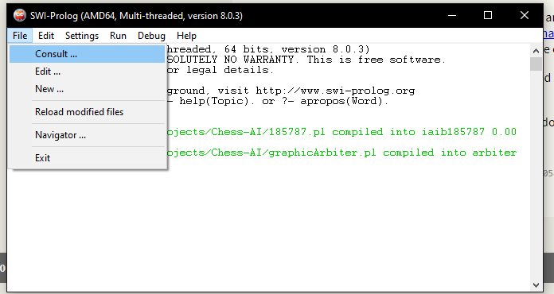
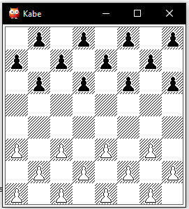

Checkers - MinMax algorithm
---

Start with downloading latest SWI-Prolog [from here](https://www.swi-prolog.org/Download.html)

Then consult both files with prolog extension.

Then write ``t(h).`` to the console and then make your move against depth 5 checkers MinMax algorithm

Best of luck!
